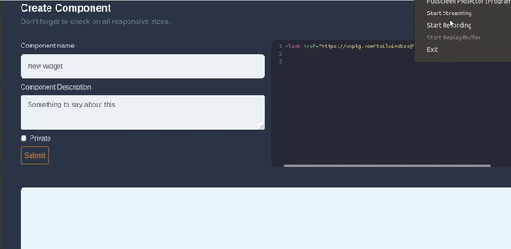

## ONLINE COMPONENTS 
[](https://travis-ci.org/MagedAhmad/Realtime-components)

A service to share code snippets and components <a href="http://realtimecomponents.site/">Live site</a>





### ABOUT 

Project is originally built for learning porpuses. it's like <a target="_blank" href="https://codepen.io/">codepen</a>. Used <a target="_blank" href="https://codemirror.net/">CodeMirror</a> to ship the online text editor.

Technologies: Laravel, Vue.


### INSTALLATION
```
composer install
cp .env.example .env
php artisan key:generate
npm install
php artisan migrate
```
### Contribution 

If you want to contribute <b>make sure</b> that 

- All tests are passing.
- Cover your code with unit tests.
- Open new Issue describing the bug/new-feature .
- Push a pull request to solve the issue.


### License 
It's an open source project licensed under <a href="https://opensource.org/licenses/MIT">MIT license</a>.